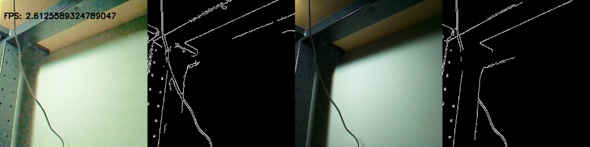
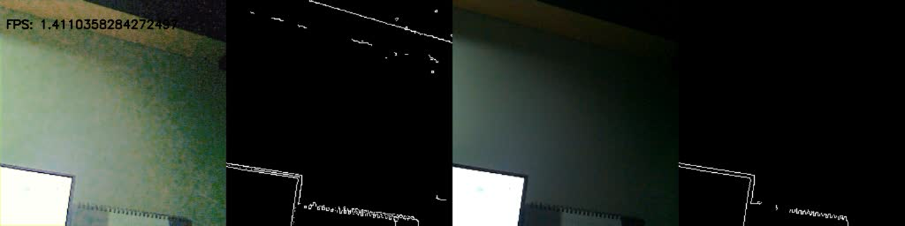

# EdgeAI Project: Image Enhancement using Intel NCS2

# Preparation
* Intel NCS2  
* Respberry Pi 4  
* Camera for Raspberry Pi
* PC

# Installation
1. openvino
2. opencv
3. picamera2 (Raspberry pi 4)
4. pytorch (PC)

# Demo
1. Download the repo and CPGA-Net (for LLIE model)
```
git install https://github.com/Shyandram/EdgeAI_LLIE_NC2.git
cd EdgeAI_LLIE_NC2
git install https://github.com/Shyandram/CPGA-Net-Pytorch.git
```
2. Convert the Pytorch model to OpenVino IR model
```
python torch2openvino.py
```
3. Demo
```
python demo_openvino.py
```

# Result




# Reference
* [openvino](https://github.com/openvinotoolkit/openvino)  
* [openvino notebooks](https://github.com/openvinotoolkit/openvino_notebooks)
* [CPGA-Net](https://github.com/Shyandram/CPGA-Net-Pytorch.git)